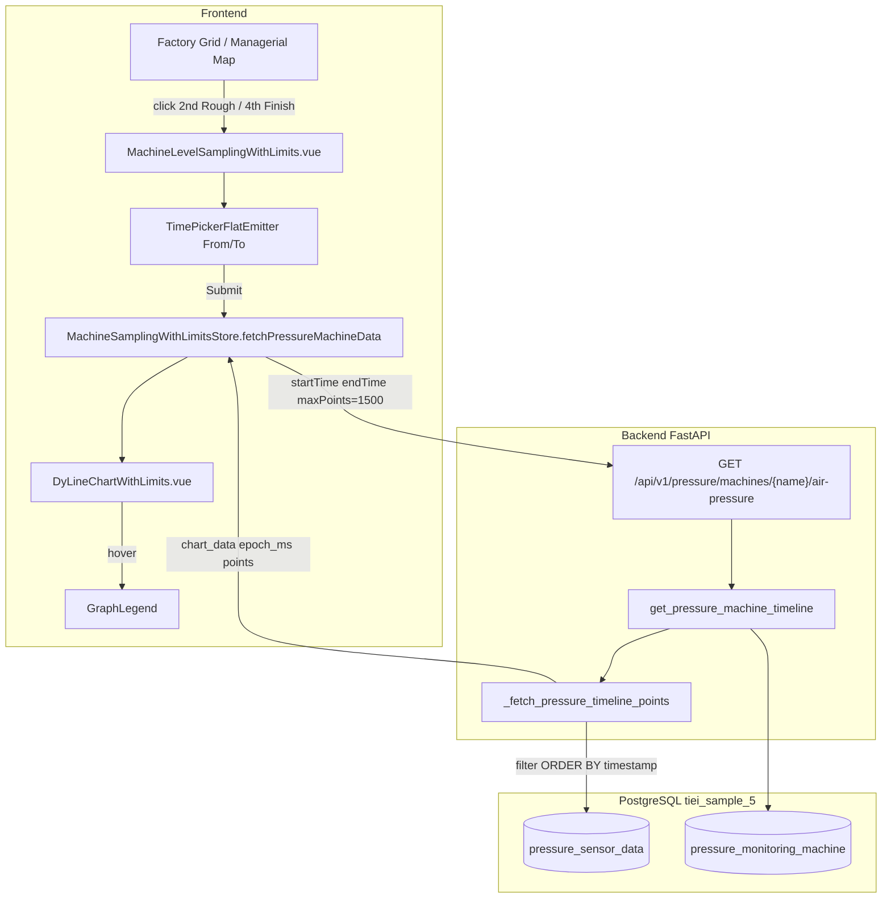

# Air Pressure Time-Series Graph — Complete Technical README

This document explains **everything implemented** for the **AIR_PRESSURE** (air honing) pressure graph: what changed, why, which files were touched, how time ranges work, how large data is handled, and how the chart behaves in the browser.

**Machines:** `2nd Rough`, `4th Finish` (BLOCK line)  
**Database schema:** `tiei_sample_5`  
**Tables:** `pressure_monitoring_machine`, `pressure_sensor_data`

---

## Table of contents

1. [Executive summary](#1-executive-summary)
2. [Before vs after](#2-before-vs-after)
3. [Database model and the timestamp fix](#3-database-model-and-the-timestamp-fix)
4. [End-to-end architecture](#4-end-to-end-architecture)
5. [Backend — constants and configuration](#5-backend--constants-and-configuration)
6. [Backend — time parsing and SQL bounds](#6-backend--time-parsing-and-sql-bounds)
7. [Backend — downsampling mechanisms](#7-backend--downsampling-mechanisms)
8. [Backend — API endpoint and response](#8-backend--api-endpoint-and-response)
9. [Why time range is limited to 1 year](#9-why-time-range-is-limited-to-1-year)
10. [How the system handles very large data](#10-how-the-system-handles-very-large-data)
11. [Frontend — Pinia store](#11-frontend--pinia-store)
12. [Frontend — sampling page UI](#12-frontend--sampling-page-ui)
13. [Frontend — chart component (Dygraphs)](#13-frontend--chart-component-dygraphs)
14. [Pressure vs other parameter charts](#14-pressure-vs-other-parameter-charts)
15. [User workflow (step by step)](#15-user-workflow-step-by-step)
16. [Test time ranges (Toyota_Demo DB)](#16-test-time-ranges-toyota_demo-db)
17. [Files changed (complete list)](#17-files-changed-complete-list)
18. [Troubleshooting](#18-troubleshooting)
19. [Future improvements](#19-future-improvements)

---

## 1. Executive summary

Air honing machines produce **high-frequency pressure readings** (100+ rows per second). The original graph:

- Was locked to a **1–3 second** window.
- Filtered on **`created_at`** (ingest time), which was **identical for every row in a batch**.
- Remapped x-axis times artificially across the filter window.
- Used a **step plot** like other MT-Linki parameters.
- Downsampled with a simple **uniform stride** to 120 points.

The new implementation:

- Uses a **flexible From / To** range: **1 second minimum → 1 year maximum**.
- Filters and plots on **`timestamp`** (true sensor reading time).
- Returns **`[epoch_ms, pressure_value]`** with real timestamps on the x-axis.
- Uses a **continuous line chart** for pressure only.
- Downsamples on the **server** using a **two-tier strategy** (SQL buckets + LTTB) capped at **~1500 points**.
- Lets the user **drag-zoom** on loaded data in the browser (client-side only).
- Shows **4–7 readable x-axis labels** instead of overlapping millisecond text.

---

## 2. Before vs after

| Topic | Before | After |
|-------|--------|-------|
| Time column | `created_at` | `"timestamp"` |
| Allowed range | 1–3 seconds | 1 second – 365 days |
| `chart_data` format | `[IST string, value]` remapped to window | `[epoch_ms, value]` true reading time |
| Chart type | Step plot (same as other params) | Continuous line (pressure only) |
| Downsampling | Uniform stride, max 120 points | LTTB + SQL `width_bucket`, max 1500 points |
| UI presets | N/A → briefly had 10s/1m/1h buttons | **Removed** — only From/To + Submit |
| Zoom | Broken (refetch reset chart) | Drag zoom in browser; double-click reset |
| Default window | 3 seconds | 60 seconds around latest sensor reading |

---

## 3. Database model and the timestamp fix

### Tables

```sql
tiei_sample_5.pressure_monitoring_machine
  id, machine_name, warning_limit, critical_limit

tiei_sample_5.pressure_sensor_data
  machine_id, pressure_value, created_at, "timestamp"
```

### Two time columns — why only `timestamp` is used now

| Column | Meaning | Problem when used for graph |
|--------|---------|----------------------------|
| `created_at` | When the row was inserted into PostgreSQL | In demo data, **all ~9000 rows share one `created_at`**. Every point stacks on one x position → vertical line / unreadable graph. |
| `"timestamp"` | Actual sensor reading time (sub-second resolution) | Spreads correctly over ~9 seconds (or hours/days in production). **Correct choice for time-series.** |

### Observed demo data (`Toyota_Demo`)

| Machine | Rows | `timestamp` span | `created_at` |
|---------|------|------------------|--------------|
| 2nd Rough | 8,996 | `2026-06-19 19:59:18` → `19:59:27` (~9 s) | Single value `2026-06-30 15:08:09` |
| 4th Finish | 9,502 | `2026-06-19 20:42:38` → `20:42:47` (~9 s) | Single value `2026-06-30 15:08:16` |

**Rule:** Always pick **From / To** inside the **`timestamp`** range. June 30 dates match `created_at` only and return **no graph data** after the fix.

### Latest reading on factory grid / managerial map

`_fetch_pressure_machine_rows()` now orders by **`"timestamp" DESC`** (not `created_at`) so `latest_update_time_ms` on the UI points to the real last sensor reading.

---

## 4. End-to-end architecture



**Data flow in one sentence:** User selects From/To → store calls API → backend queries `pressure_sensor_data` by `"timestamp"` → downsamples to ≤1500 points → frontend renders Dygraphs line chart with pressure (Pa) on Y and time on X.

---

## 5. Backend — constants and configuration

**File:** `backend/machine_monitoring_app/database/crud_operations.py`

| Constant | Value | Purpose |
|----------|-------|---------|
| `PRESSURE_MIN_RANGE_SECONDS` | `1` | Smallest allowed window (prevents zero-width queries) |
| `PRESSURE_MAX_RANGE_SECONDS` | `365 * 24 * 3600` | Largest allowed window = **1 year** |
| `PRESSURE_MAX_CHART_POINTS` | `2000` | Hard cap on `maxPoints` query param |
| `PRESSURE_DEFAULT_CHART_POINTS` | `1500` | Default points returned if `maxPoints` omitted |
| `PRESSURE_DB_TIMEZONE` | `Asia/Kolkata` | Naive DB datetimes interpreted as IST |
| `PRESSURE_SENSOR_TIME_COL` | `'"timestamp"'` | SQL-quoted column name for filters/sorts |

---

## 6. Backend — time parsing and SQL bounds

### `parse_pressure_time_param(value)`

Accepts:

- Epoch milliseconds: `1781879358000`
- IST datetime string: `2026-06-19 19:59:18` or with fractional seconds

Returns **float epoch ms** used everywhere internally.

### `_pressure_sql_time_bounds(start_ms, end_ms)`

1. Converts epoch ms → naive IST `datetime`.
2. Sets end microsecond to `999999` so the **full last second** is included (readings often have sub-second precision).

### SQL filter (all timeline queries)

```sql
WHERE machine_id = {id}
  AND "timestamp" >= TIMESTAMP '{start}'
  AND "timestamp" <= TIMESTAMP '{end}'
ORDER BY "timestamp" ASC
```

### `get_pressure_machine_timeline(machine_name, start_time, end_time, max_points=None)`

1. Validates range ∈ [1 s, 1 year].
2. Loads machine limits from `pressure_monitoring_machine`.
3. Calls `_fetch_pressure_timeline_points(...)`.
4. Builds JSON response with `chart_data`, limits, metadata (`downsampled`, `returned_points`, etc.).

---

## 7. Backend — downsampling mechanisms

High-rate sensors can produce **millions of rows** over days. Sending all points to the browser would freeze the UI. Downsampling happens **on the server** before the HTTP response.

### Tier 1 — Fast probe (cheap count)

```sql
SELECT COUNT(*) FROM (
  SELECT 1 FROM pressure_sensor_data
  WHERE ... timestamp in range ...
  LIMIT max_points + 1
) probe
```

- If count ≤ `max_points` (default 1500): **load all rows** (raw detail path).
- If count > `max_points`: switch to **Tier 2** (aggregation path).

### Tier 2a — Raw path + LTTB (small/medium windows)

When row count fits in budget:

1. `SELECT "timestamp", pressure_value ... ORDER BY "timestamp"`.
2. Convert each row to `[epoch_ms, pressure_value]`.
3. If still > `max_points`, apply **LTTB** (Largest-Triangle-Three-Buckets).

**Why LTTB?** Unlike uniform stride (every Nth row), LTTB keeps **peaks, dips, and shape** of the pressure curve — important for limit breaches.

**Function:** `_lttb_downsample_pressure(points, max_points)`

- Always keeps **first** and **last** point.
- For each bucket, picks the point that forms the **largest triangle area** with the previous selected point and the bucket average — visually faithful downsampling used in time-series tools.

### Tier 2b — SQL `width_bucket` + AVG (large windows: hours → year)

When row count exceeds `max_points`:

```sql
WITH filtered AS ( ... rows in range ... ),
bounds AS ( SELECT MIN/MAX epoch of reading_ts ),
SELECT MIN(reading_ts), AVG(pressure_value)
GROUP BY width_bucket(epoch, e0, e1, max_points)
ORDER BY 1
```

- PostgreSQL **`width_bucket`** splits the time span into exactly `max_points` buckets.
- Each bucket returns **average pressure** and **earliest timestamp** in that bucket.
- Result is ≤ `max_points` rows **before** leaving the database — protects memory and network.
- **Safety pass:** `_lttb_downsample_pressure` again if bucket count somehow exceeds cap.

### Response flag

```json
"downsampled": true,
"message": "Downsampled timeline (1500 points). Zoom or tighten From/To for higher detail."
```

User sees this when aggregation path was used. Tightening From/To (e.g. 10 seconds instead of 7 days) triggers the raw+LTTB path with more detail.

---

## 8. Backend — API endpoint and response

**File:** `backend/machine_monitoring_app/routers/core_data_route.py`

### Endpoint

```
GET /api/v1/pressure/machines/{machineName}/air-pressure
```

### Query parameters

| Param | Type | Default | Description |
|-------|------|---------|-------------|
| `startTime` | string/number | required | Epoch ms or `YYYY-MM-DD HH:MM:SS` (IST) |
| `endTime` | string/number | required | Same format as start |
| `maxPoints` | int | `1500` | Clamped to 50–2000 |

### Example

```
GET /api/v1/pressure/machines/2nd%20Rough/air-pressure
  ?startTime=2026-06-19%2019:59:18
  &endTime=2026-06-19%2019:59:28
  &maxPoints=1500
```

### Response fields

| Field | Type | Description |
|-------|------|-------------|
| `chart_data` | `[[epoch_ms, number], ...]` | Points for Dygraphs |
| `warning_limit` | number | From `pressure_monitoring_machine` |
| `critical_limit` | number | From `pressure_monitoring_machine` |
| `filter_time_window` | `{start, end}` | IST strings echoing user selection |
| `legend_data` | object | X: Timestamp, Y: Air Pressure (Pa) |
| `min_range_seconds` | `1` | UI validation hint |
| `max_range_seconds` | `31536000` | UI validation hint (365 days) |
| `returned_points` | int | Length of `chart_data` |
| `max_points` | int | Cap used for this request |
| `downsampled` | bool | Whether SQL bucket path ran |
| `probed_count` | int/null | Raw count when probe path used |
| `message` | string | Human-readable status |

### Alternate route (same logic)

```
GET /api/v1/factory/machines/{machineName}/parameters-mtlinki/AIR_PRESSURE
```

Also routes to `get_pressure_machine_timeline` when `parameterName` is `AIR_PRESSURE`.

---

## 9. Why time range is limited to 1 year

| Reason | Explanation |
|--------|-------------|
| **UI purpose** | Shop-floor monitoring focuses on recent behaviour (seconds → days). Year view is already an overview; multi-year analytics belong in a separate reporting tool. |
| **Memory & latency** | Even with downsampling, extremely wide ranges increase SQL scan cost and response size. |
| **Point budget** | At 100 rows/sec, 1 year ≈ 3.15 billion rows — must aggregate. One year is a practical upper bound for interactive charting. |
| **Configurable** | `PRESSURE_MAX_RANGE_SECONDS` in `crud_operations.py` is the single knob to change the cap. |

Minimum **1 second** prevents accidental `from == to` or inverted micro-ranges that return misleading single-point charts.

---

## 10. How the system handles very large data

### Scenario A — 9 seconds, ~9000 rows (demo DB)

1. Probe: 8996 > 1500 → **bucket path** OR if probe uses LIMIT trick, may load all then LTTB to 1500.
2. Actually: probe counts with LIMIT 1501 — if 8996 rows exist, count returns 1501+ → **SQL width_bucket** → ~1500 averaged points.
3. Browser receives 1500 points — smooth line, no crash.

### Scenario B — User selects 10 seconds with 1000 rows/sec ≈ 100,000 rows

1. Probe exceeds 1500 → **width_bucket** aggregation in SQL.
2. Only ~1500 points over the wire.
3. User drags zoom on chart (client-side) to inspect loaded shape.

### Scenario C — User selects 7 days with continuous production

1. Bucket aggregation produces ~1500 points across 7 days (one point per ~6.7 minutes on average).
2. Message shows "Downsampled timeline".
3. User narrows From/To to 1 hour → more buckets per second of data → finer detail.

### Scenario D — Year selection

1. Same bucket mechanism spans 365 days.
2. Chart shows long-term trend; not per-second detail (by design).
3. No browser crash because payload stays ≤1500 points.

### What we deliberately do NOT do

- **No full dump** of millions of rows to the frontend.
- **No refetch on mouse drag zoom** (was removed — it reset the chart and broke zoom). Zoom is **visual only** on already-loaded points. For finer data, user submits a **smaller From/To**.

---

## 11. Frontend — Pinia store

**File:** `frontend/src/stores/MachineSamplingWithLimitsStore.js`

### Exported constants

| Constant | Value | Use |
|----------|-------|-----|
| `PRESSURE_DEFAULT_RANGE_SECONDS` | `60` | Initial window when opening a pressure machine |
| `PRESSURE_FALLBACK_MIN_SECONDS` | `1` | Validation if API limits not yet loaded |
| `PRESSURE_FALLBACK_MAX_SECONDS` | `365 * 24 * 3600` | Validation max |

### Key getters

- **`isPressureContext`** — true when machine/group/param is `AIR_PRESSURE` or `is_pressure_machine`.
- **`pressureRangeSeconds`** — `(to - from) / 1000`.
- **`isValidPressureTimeRange`** — within min/max from API.

### Key actions

| Action | Behaviour |
|--------|-----------|
| `refreshPressureTimestampAround(latest, 60)` | Sets From = latest − 60s, To = latest (anchored on last sensor reading) |
| `normalizeInvertedPressureTimeRange()` | Swaps from/to if user picked reversed order |
| `fetchPressureMachineData()` | `GET .../air-pressure?startTime=&endTime=&maxPoints=1500` |
| `applyTimelineResponse()` | Stores `chart_data`, limits, updates `pressureRangeLimits` from API |

### Pressure detection routing

`fetchMachineParameterData()` redirects to `fetchPressureMachineData()` when context is air pressure — never hits MT-Linki Mongo timeline for these machines.

---

## 12. Frontend — sampling page UI

**File:** `frontend/src/views/MachineLevelSamplingWithLimits.vue`  
**Route:** `/machine-level-sampling`

### Pressure-specific UI

| Element | Behaviour |
|---------|-----------|
| **From / To** | `TimePickerFlatEmitter` with **seconds** enabled; values stored as epoch ms |
| **Submit** | Validates range 1 s – 365 days, then `fetchPressureMachineData()` |
| **Warning / Critical limits** | Read-only display (no edit for pressure machines) |
| **Hint text** | "Select From / To (up to 365 days). Drag on chart to zoom in; double-click to reset." |
| **Removed** | Static preset buttons (10s, 1m, 5m, 1h, 1d, 7d) |

### Chart binding

```vue
<DyLineChartWithLimits
  :data="chartData"
  :warningLimit="warningLimit"
  :criticalLimit="criticalLimit"
  :step-plot="!isPressureSelected"   <!-- false for pressure = line chart -->
  @data-hovered="OnHoverCallBack"
/>
```

### Entry points that open pressure graph

| File | Trigger |
|------|---------|
| `FactoryPollOverview.vue` | Click `2nd Rough` / `4th Finish` under AIR_PRESSURE |
| `ManagerialOverview.vue` | Click air honing machine / alert |
| `MachineWithParameters.vue` | Pressure machine card |

---

## 13. Frontend — chart component (Dygraphs)

**File:** `frontend/src/components/Charts/DyLineChartWithLimits.vue`  
**Library:** [Dygraphs](https://dygraphs.com/) v2.x (`dygraphs` npm package)

### Props

| Prop | Pressure value | Other params |
|------|----------------|--------------|
| `stepPlot` | `false` (smooth line) | `true` (step chart) |
| `data` | `[epoch_ms, value][]` from API | `[epoch_ms, value][]` from MT-Linki |

### Three series rendered

1. **Value** — green filled area (`rgb(5, 150, 105)`)
2. **Warning limit** — orange horizontal line
3. **Critical limit** — red horizontal line

### X-axis readability fix

**Problem:** 1500 points over 9 seconds caused Dygraphs to print **millisecond labels** on every tick → overlapping unreadable text.

**Solution:**

1. **`timeSeriesXTicker`** — custom ticker placing only **4–7** evenly spaced labels across the plot width.
2. **`formatAxisTime(ms)`** — label format adapts to data span:

   | Data span | Label format |
   |-----------|--------------|
   | ≤ 3 s | `HH:MM:SS.mmm` |
   | 3 s – 2 h | `HH:MM:SS` |
   | 2 h – 2 days | `DD/MM HH:MM` |
   | 2 – 14 days | `DD/MM HH:MM` |
   | > 14 days | `DD/MM/YY` |

3. **`pixelsPerLabel: 120`** for time-series mode — minimum gap between labels.

### Mouse interaction

| Gesture | Effect |
|---------|--------|
| **Click + drag** on chart | Zoom into selected time region (client-side, `animatedZooms: true`) |
| **Double-click** | Reset zoom to full loaded range |
| **Hover** | Highlights nearest point; emits `data-hovered` → `GraphLegend` shows timestamp + Pa |

**Important:** Zoom does **not** call the API again. To load different data density, change From/To and press Submit.

### Chart updates

`syncChart()` uses `updateOptions({ file, ... })` when the chart already exists — avoids full destroy/recreate on minor updates.

---

## 14. Pressure vs other parameter charts

| Aspect | AIR_PRESSURE (2nd Rough, 4th Finish) | Other MT-Linki parameters |
|--------|----------------------------------------|----------------------------|
| Data source | PostgreSQL `pressure_sensor_data` | Mongo / MT-Linki timeline |
| API | `/pressure/machines/.../air-pressure` | `/factory/machines/.../parameters-mtlinki/...` |
| Time column | `"timestamp"` | Parameter timestamp from MT-Linki |
| Chart style | Line (`stepPlot: false`) | Step (`stepPlot: true`) |
| Default range | 60 s around latest reading | 1 hour |
| Max range | 365 days | 6 hours for DYNAMIC_PARAMETERS |
| Limit editing | Disabled | Enabled in UI |
| Cycle time | N/A | Separate ECharts bar chart path |

---

## 15. User workflow (step by step)

1. Open **Factory Grid** or **Managerial Overview**.
2. Select parameter group **AIR_PRESSURE** (or click `2nd Rough` / `4th Finish`).
3. Navigate to **Machine Level Sampling** page.
4. UI pre-fills **From / To** = last **60 seconds** ending at latest `"timestamp"` from DB.
5. Adjust From/To to a range where data exists (see [section 16](#16-test-time-ranges-toyota_demo-db)).
6. Click **Submit** → API returns downsampled `chart_data`.
7. Graph renders: **Y = Pressure (Pa)**, **X = time**.
8. **Drag** on chart to magnify a region; **double-click** to reset.
9. Hover for exact value in legend below chart.
10. For longer trends (days), widen From/To — server aggregates automatically.

---

## 16. Test time ranges (Toyota_Demo DB)

Use these **`timestamp`** ranges (IST):

### 2nd Rough

| From | To | Expected |
|------|-----|----------|
| `2026-06-19 19:59:18` | `2026-06-19 19:59:28` | ~8996 rows → ~1500 chart points |
| `2026-06-19 19:58:27` | `2026-06-19 19:59:27` | 60 s window (good for testing) |

### 4th Finish

| From | To | Expected |
|------|-----|----------|
| `2026-06-19 20:42:38` | `2026-06-19 20:42:48` | ~9502 rows → ~1500 chart points |

### Ranges that return NO data (after timestamp fix)

| From | To | Why |
|------|-----|-----|
| `2026-06-30 15:08:00` | `2026-06-30 15:09:00` | Matches `created_at` only, not sensor `timestamp` |

### Inspect DB locally

```bash
python backend/scripts/peek_pressure_ranges.py
```

---

## 17. Files changed (complete list)

### Backend

| File | Changes |
|------|---------|
| `backend/machine_monitoring_app/database/crud_operations.py` | Pressure constants; `timestamp` filter; LTTB; SQL `width_bucket`; `get_pressure_machine_timeline`; latest reading by `timestamp` |
| `backend/machine_monitoring_app/routers/core_data_route.py` | `maxPoints` query param; updated docstring for timestamp-based API |

### Frontend

| File | Changes |
|------|---------|
| `frontend/src/stores/MachineSamplingWithLimitsStore.js` | Flexible range; `fetchPressureMachineData` with `maxPoints=1500`; 60s default |
| `frontend/src/views/MachineLevelSamplingWithLimits.vue` | Pressure validation; removed presets; line chart mode; hint text |
| `frontend/src/components/Charts/DyLineChartWithLimits.vue` | Time-series line mode; custom x ticker; drag zoom; adaptive labels |
| `frontend/src/views/FactoryPollOverview.vue` | 60s default window on pressure machine click |

### Scripts / utilities

| File | Purpose |
|------|---------|
| `backend/scripts/peek_pressure_ranges.py` | Inspect per-machine timestamp spans and row counts |
| `backend/scripts/test_pressure_queries.py` | Manual SQL tests |
| `backend/scripts/test_pressure_raw_sql.py` | Raw SQL via Pony connection |
| `backend/scripts/test_user_timestamps.py` | Timestamp parsing checks |

### Documentation

| File | Purpose |
|------|---------|
| `AIR_PRESSURE_MONITORING_FEATURE_README.md` | Original feature changelog (partially outdated on 1–3s range) |
| `PRESSURE_TIME_SERIES_GRAPH_README.md` | **This file** — complete current behaviour |

### Related (not graph core, same feature)

| File | Role |
|------|------|
| `frontend/src/views/ManagerialOverview.vue` | Air honing map icons (`mch1.svg`), navigation to sampling |
| `frontend/src/views/ManagerialOverviewConfig.js` | `honingIconScale` for icon sizing |
| `frontend/src/components/MachineWithParameters.vue` | No AP axis for pressure cards |

---

## 18. Troubleshooting

| Symptom | Likely cause | Fix |
|---------|--------------|-----|
| Empty graph | From/To outside `timestamp` range in DB | Use ranges from [section 16](#16-test-time-ranges-toyota_demo-db) |
| Vertical line / single x position | Old code using `created_at` | Ensure backend restarted with `timestamp` changes |
| Overlapping x labels | Very dense data + old ticker | Hard-refresh frontend; verify `stepPlot=false` for pressure |
| Zoom not working | Old build refetched on zoom | Update frontend; zoom is client-side only |
| "Downsampled timeline" message | More rows than `maxPoints` in range | Normal for large windows; narrow From/To for detail |
| 400 error on Submit | Range < 1 s or > 365 days | Adjust pickers |
| CORS / API errors | Backend not running | Start FastAPI on port 8000 |

---

## 19. Future improvements

- **Server-side zoom refetch** — optional: on drag-release, request narrower range with higher `maxPoints` (must not reset Dygraphs zoom state).
- **Index** on `(machine_id, "timestamp")` for faster year-scale scans.
- **WebSocket live tail** — append new points for "last 60 s" live mode without full Submit.
- **Export CSV** — download raw or downsampled series for the selected window.
- **Align** `AIR_PRESSURE_MONITORING_FEATURE_README.md` with this document or merge into one file.

---

## Quick reference card

```
┌─────────────────────────────────────────────────────────────────┐
│  AIR PRESSURE GRAPH — QUICK REFERENCE                           │
├─────────────────────────────────────────────────────────────────┤
│  DB time column     : pressure_sensor_data."timestamp" (IST)     │
│  API                : GET /api/v1/pressure/machines/{name}/     │
│                       air-pressure?startTime=&endTime=          │
│  Range              : 1 second – 365 days                       │
│  Max points         : 1500 (configurable 50–2000)               │
│  Downsampling       : SQL width_bucket → LTTB                     │
│  Chart              : Dygraphs line + warning/critical overlays   │
│  Y-axis             : Pressure (Pa)                             │
│  X-axis             : True sensor timestamp                       │
│  Zoom               : Drag in chart; double-click reset         │
│  Demo 2nd Rough     : 2026-06-19 19:59:18 → 19:59:28           │
│  Demo 4th Finish    : 2026-06-19 20:42:38 → 20:42:48           │
└─────────────────────────────────────────────────────────────────┘
```

---

*Last updated: reflects implementation through pressure time-series graph, timestamp column migration, downsampling, and Dygraphs UX fixes.*
